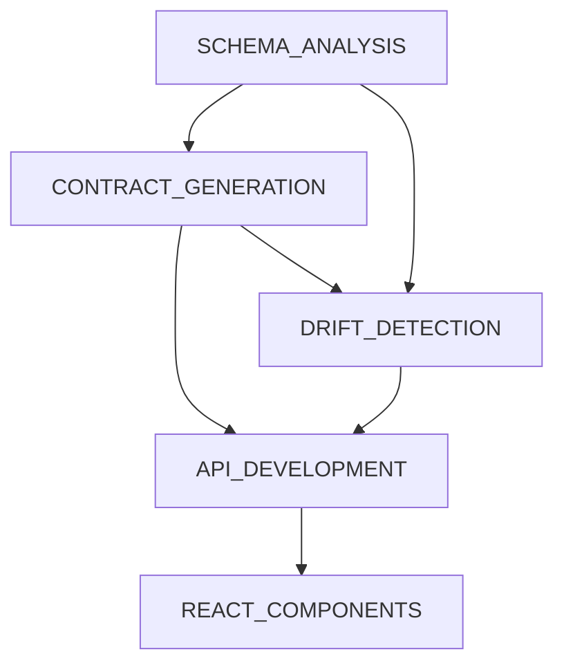

# DataContractIQ Skills Library

This directory contains reusable instruction sets (skills) for building DataContractIQ. Each skill provides specialized, consistent, and repeatable workflows for specific aspects of the software development lifecycle.

## Available Skills

### 1. [SCHEMA_ANALYSIS.md](SCHEMA_ANALYSIS.md)
**Purpose:** Analyze database schemas to extract metadata, relationships, constraints, and business rules.

**Use When:**
- Analyzing SQL DDL files
- Introspecting live databases
- Extracting schema metadata for contract generation
- Understanding table relationships and dependencies

**Key Outputs:**
- Table structures with columns and data types
- Constraint definitions (PK, FK, unique, check)
- Relationship mappings
- Business rule extraction

---

### 2. [CONTRACT_GENERATION.md](CONTRACT_GENERATION.md)
**Purpose:** Generate formal, human-readable data contracts from database schemas using IBM Bob.

**Use When:**
- Creating initial data contracts from existing schemas
- Documenting implicit business rules
- Generating contracts for multiple related tables
- Producing both machine-readable and human-readable formats

**Key Outputs:**
- Structured JSON contracts
- Human-readable Markdown documentation
- Flagged ambiguities with targeted questions
- Business rule documentation

---

### 3. [DRIFT_DETECTION.md](DRIFT_DETECTION.md)
**Purpose:** Detect and analyze changes between approved data contracts and current database schemas.

**Use When:**
- Monitoring schema changes in production
- Validating schema migrations
- Detecting unauthorized schema modifications
- Assessing impact of proposed changes

**Key Outputs:**
- Change detection reports
- Impact analysis with Bob's intelligence
- Severity classification
- Remediation recommendations

---

### 4. [API_DEVELOPMENT.md](API_DEVELOPMENT.md)
**Purpose:** Build RESTful API endpoints using FastAPI with proper structure, validation, and error handling.

**Use When:**
- Creating new API endpoints
- Implementing request/response models
- Adding validation logic
- Handling errors gracefully

**Key Outputs:**
- FastAPI route implementations
- Pydantic models for validation
- Error handling patterns
- API documentation

---

### 5. [REACT_COMPONENTS.md](REACT_COMPONENTS.md)
**Purpose:** Build reusable, type-safe React components using TypeScript and modern React patterns.

**Use When:**
- Creating UI components for contract viewing and editing
- Building interactive forms and question cards
- Implementing data visualization
- Managing component state and API interactions

**Key Outputs:**
- TypeScript React components
- Custom hooks for API integration
- Styled components with TailwindCSS
- Type-safe interfaces

---

## How to Use These Skills

### During Planning
Reference skills when breaking down tasks:
```
Task: Generate data contract for film table
Skills: SCHEMA_ANALYSIS → CONTRACT_GENERATION
```

### During Implementation
Follow the skill's process section step-by-step:
```
1. Read SCHEMA_ANALYSIS.md
2. Follow "Process" section
3. Use provided code examples
4. Validate against checklist
```

### During Code Review
Verify implementation matches skill guidelines:
```
- Does the API follow API_DEVELOPMENT patterns?
- Are React components structured per REACT_COMPONENTS?
- Is error handling implemented correctly?
```

## Skill Dependencies



## Quick Reference

| Task | Primary Skill | Supporting Skills |
|------|--------------|-------------------|
| Parse SQL file | SCHEMA_ANALYSIS | - |
| Generate contract | CONTRACT_GENERATION | SCHEMA_ANALYSIS |
| Detect schema changes | DRIFT_DETECTION | SCHEMA_ANALYSIS, CONTRACT_GENERATION |
| Build API endpoint | API_DEVELOPMENT | All backend skills |
| Create UI component | REACT_COMPONENTS | API_DEVELOPMENT |

## Best Practices

1. **Read the Full Skill** - Don't skip sections, each provides important context
2. **Follow the Process** - Steps are ordered for optimal workflow
3. **Use the Checklists** - Validate your work against completion criteria
4. **Leverage Examples** - Code examples show best practices
5. **Check Integration** - Note how skills connect to each other

## Adding New Skills

When creating a new skill document:

1. **Use the Template:**
   ```markdown
   # Skill: [Name]
   
   ## Purpose
   [What this skill accomplishes]
   
   ## When to Use
   [Specific scenarios]
   
   ## Process
   [Step-by-step instructions]
   
   ## Output Format
   [Expected results]
   
   ## Tools to Use
   [Relevant tools]
   
   ## Validation Checklist
   [Completion criteria]
   
   ## Example Usage
   [Code examples]
   
   ## Integration with Other Skills
   [Dependencies and connections]
   ```

2. **Keep It Focused** - One skill per concern
3. **Provide Examples** - Show, don't just tell
4. **Include Checklists** - Make validation easy
5. **Update README** - Add to this index

## Contributing

When updating skills:
- Maintain consistent formatting
- Add real-world examples
- Update integration notes
- Keep checklists current
- Document breaking changes

## Version History

- **v1.0** (2026-05-01) - Initial skill library created
  - SCHEMA_ANALYSIS
  - CONTRACT_GENERATION
  - DRIFT_DETECTION
  - API_DEVELOPMENT
  - REACT_COMPONENTS

---

*These skills are living documents. Update them as you learn better patterns and practices.*